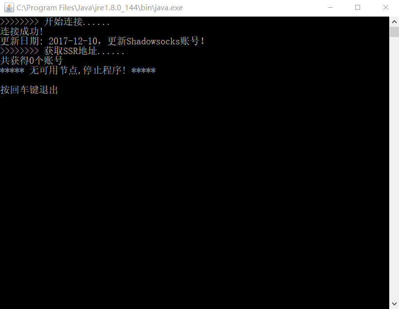
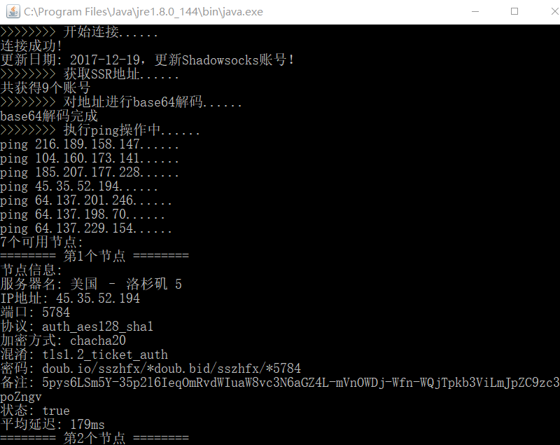
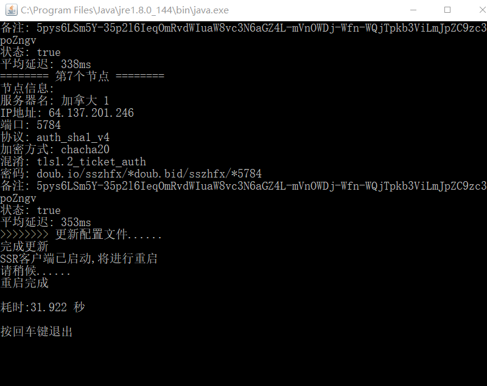
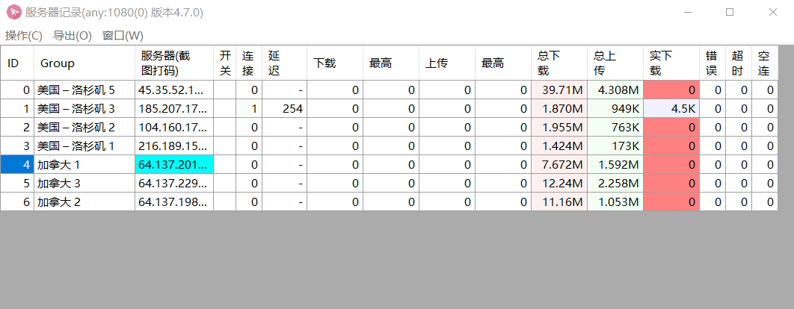

FreeSSR
====
## 简介
&emsp;&emsp;用JAVA做的小爬虫,爬取逗比根据地的免费可用的SSR账号,并进行ping测试,对电脑上的SSR的配置文件gui-config.json进行更新,最后启动或重启SSR以应用新的配置文件.

## 使用JAR包
    解析HTML : jsoup-1.11.2
    解析json : GSON-2.7

## 环境
    开发工具 : Eclipse
    java环境 : JDK 1.8

## 使用说明

    在FreeSSR主类属性中改一下SSR相关部分(可执行程序文件位置、json配置文件位置),
    导出jar包,每次双击执行,就可以爬取最新账号信息,并更新配置文件了。

## 参考
[入门：用Python抓取网页上的免费账号（一)](https://zhuanlan.zhihu.com/p/26812231)

## 运行效果图

1. 失败

2. 成功1

3. 成功2

4. SSR客户端

